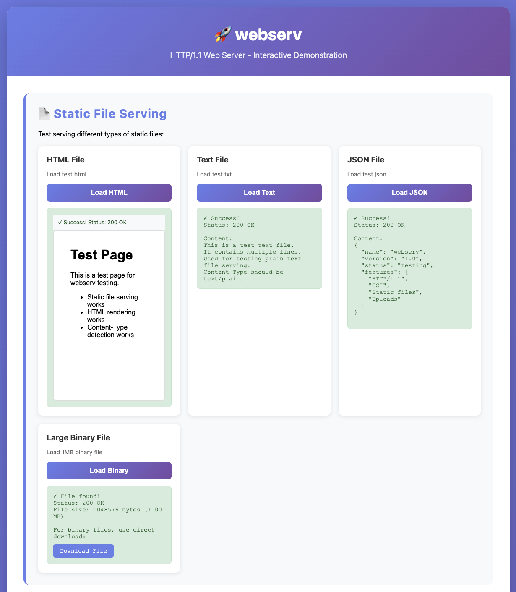
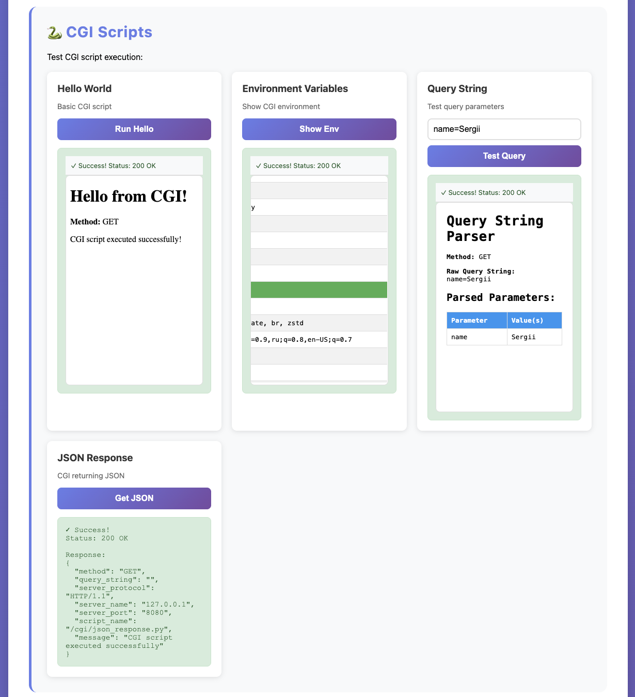
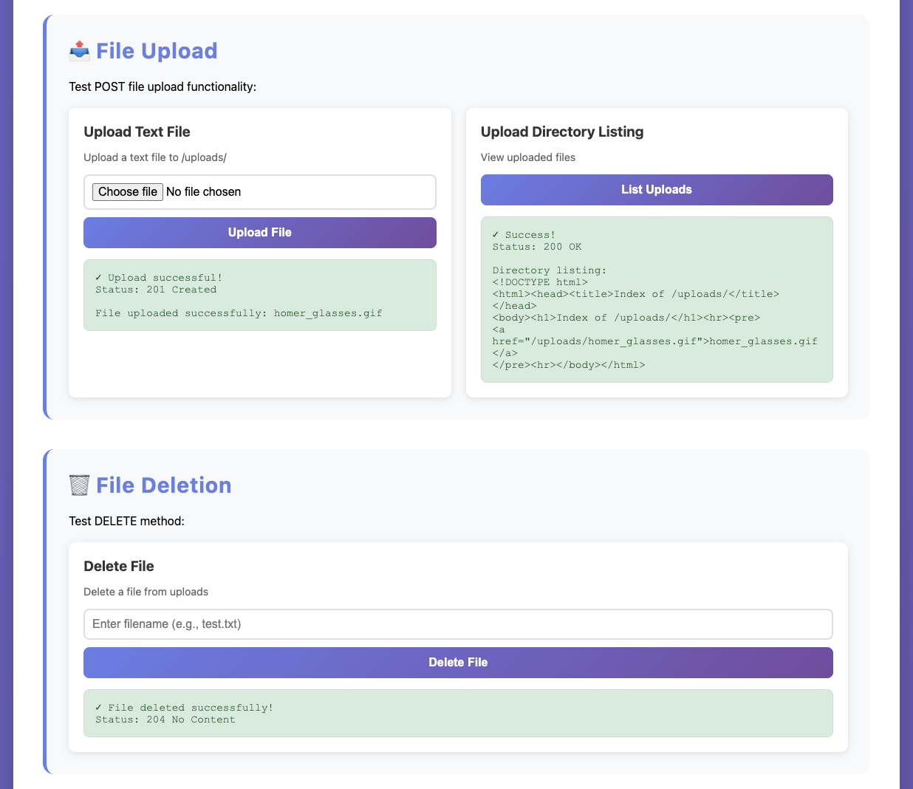
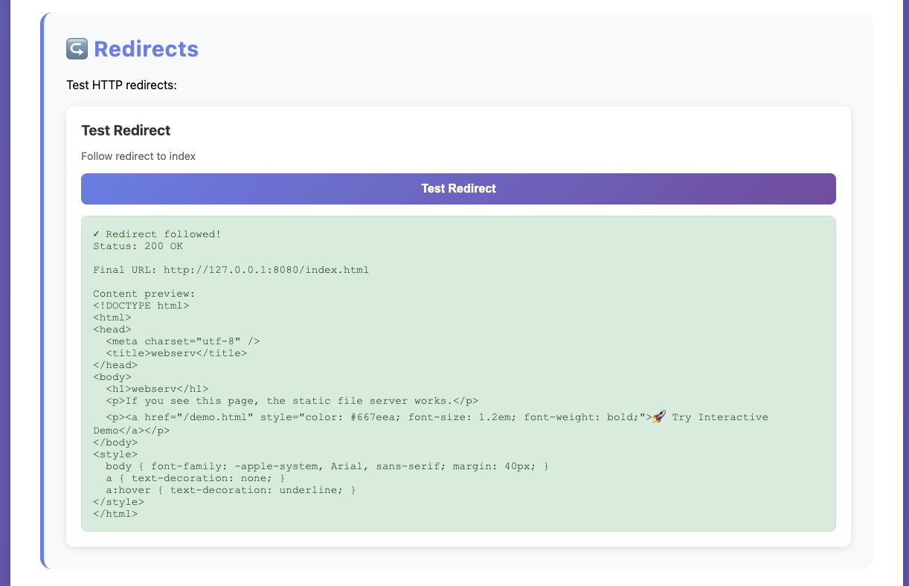
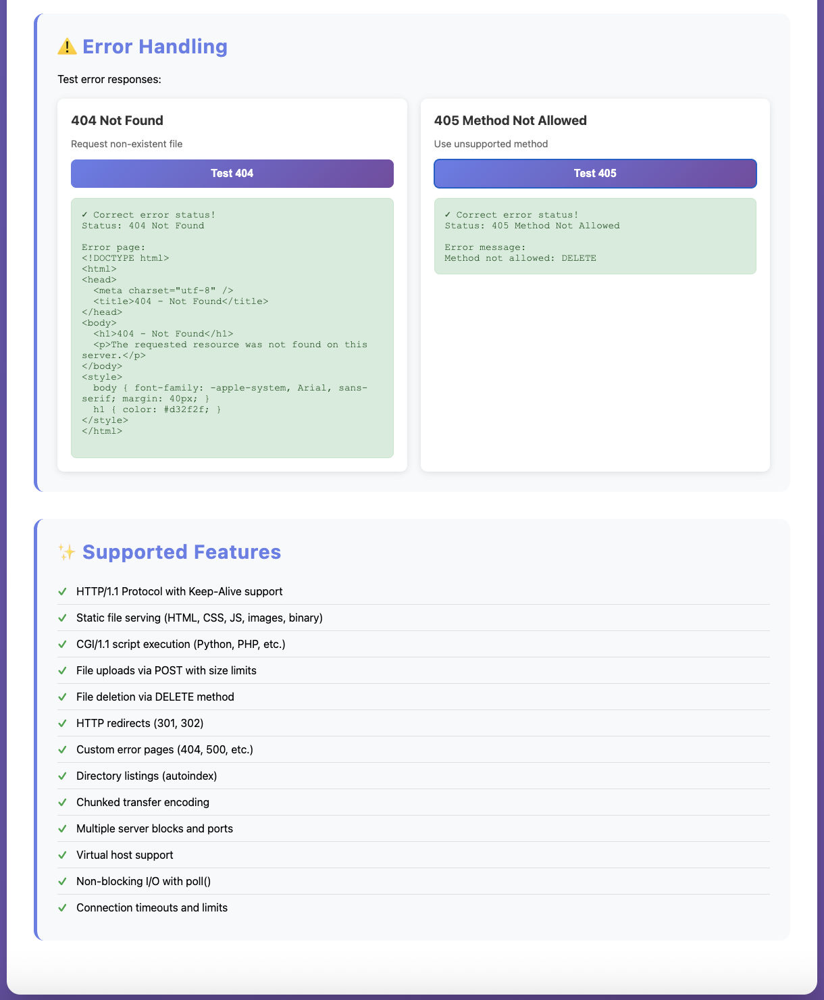

# webserv

HTTP/1.1 web server developed individually as part of the 42 project. Implements a non-blocking event-driven architecture with support for multiple clients, CGI scripts, redirects, and flexible configuration.

## Features

### Core Functionality

- ✅ **HTTP/1.1 Protocol** - Full request/response handling
- ✅ **Non-blocking I/O** - Single event loop using `poll()` for efficient concurrent connections
- ✅ **Multiple Server Blocks** - Listen on multiple ports with different configurations
- ✅ **Virtual Hosts** - Support for multiple server configurations

### HTTP Methods

- ✅ **GET** - Serve static files and handle directory listings
- ✅ **POST** - File uploads with size limits
- ✅ **DELETE** - File deletion with proper status codes

### Static File Serving

- ✅ **Static Files** - Serve files from document root
- ✅ **Directory Index** - Configurable index files
- ✅ **Autoindex** - Automatic directory listing generation
- ✅ **Error Pages** - Custom error pages for 4xx and 5xx errors

### Advanced Features

- ✅ **CGI Support** - Execute Python scripts and other interpreters via CGI/1.1
- ✅ **Redirects** - HTTP 301/302 redirects at location level
- ✅ **File Uploads** - POST requests with upload store configuration
- ✅ **Keep-Alive** - HTTP connection reuse
- ✅ **Chunked Encoding** - Support for Transfer-Encoding: chunked

### Configuration

- ✅ **Nginx-inspired Syntax** - Familiar configuration format
- ✅ **Flexible Location Blocks** - Path-based routing with method restrictions
- ✅ **Multiple Listen Directives** - Bind to multiple interfaces/ports
- ✅ **Client Limits** - Configurable body size limits and timeouts

## Building

```bash
make
```

The build system creates the `webserv` executable with the following flags:
- `-Wall -Wextra -Werror`
- `-std=c++98`

### Build Targets

- `make` or `make all` - Build the project
- `make clean` - Remove object files
- `make fclean` - Remove object files and binary
- `make re` - Rebuild from scratch
- `make format` - Format source code (requires clang-format)
- `make lint` - Run static analysis (requires clang-tidy)

## Running

### Basic Usage

```bash
./webserv <configuration_file>
```

### Launch Examples

**Basic server:**
```bash
./webserv config/example.conf
```

**Full-featured server:**
```bash
./webserv config/test_valid.conf
```

**Multi-port server:**
```bash
./webserv config/test_multiport.conf
```

**CGI-enabled server:**
```bash
./webserv config/test_cgi.conf
```

The server will start listening on the configured ports and log startup information. Press `Ctrl+C` to stop the server gracefully.

### Interactive Demo

Once the server is running, you can access the interactive demonstration page:

```bash
# Start server
./webserv config/test_valid.conf

# Open in browser
# http://127.0.0.1:8080/demo.html
```

The demo page (`/demo.html`) provides an interactive interface to test all features:
- Static file serving (HTML, text, JSON, binary)
- CGI script execution
- File uploads and downloads
- File deletion
- HTTP redirects
- Error handling (404, 405)
- Directory listings

Or simply visit the main page and click the "🚀 Try Interactive Demo" link.

## Configuration

### Basic Server Configuration

```nginx
server {
    listen 127.0.0.1:8080;
    root www;
    index index.html;
    client_max_body_size 10485760;
    
    error_page 404 /404.html;
    
    location / {
        methods GET;
    }
}
```

### Location Blocks

```nginx
location /uploads {
    methods GET POST;
    upload_store www/uploads;
    autoindex on;
}

location /cgi {
    cgi_pass .py /usr/bin/python3;
    methods GET POST;
}

location /redirect {
    return 302 /index.html;
}
```

### Multiple Server Blocks

```nginx
server {
    listen 127.0.0.1:8080;
    root www;
}

server {
    listen 127.0.0.1:8081;
    root www2;
}
```

See example configurations in the `config/` directory:
- `config/example.conf` - Basic configuration
- `config/test_valid.conf` - Full featured example
- `config/test_cgi.conf` - CGI configuration
- `config/test_multiport.conf` - Multi-port setup
- `config/test_redirects.conf` - Redirect examples

## Supported Features

| Feature | Status | Description |
|---------|--------|-------------|
| **HTTP Protocol** |
| HTTP/1.1 | ✅ | Full protocol support with proper headers |
| HTTP/1.0 | ✅ | Backward compatibility |
| Keep-Alive | ✅ | Connection reuse for multiple requests |
| Chunked Encoding | ✅ | Transfer-Encoding: chunked support |
| **HTTP Methods** |
| GET | ✅ | Static file serving with Range support |
| POST | ✅ | File uploads with size limits |
| DELETE | ✅ | File deletion with proper status codes |
| **Request Handling** |
| Query Strings | ✅ | URL parameter parsing |
| Headers | ✅ | Full header parsing and validation |
| Body Parsing | ✅ | Content-Length and chunked body support |
| Path Normalization | ✅ | Security against directory traversal |
| **Response Features** |
| Status Codes | ✅ | Complete HTTP status code support (2xx, 3xx, 4xx, 5xx) |
| Custom Error Pages | ✅ | Configurable error pages per status code |
| Content-Type | ✅ | Automatic MIME type detection |
| **File Serving** |
| Static Files | ✅ | Binary and text file serving |
| Directory Index | ✅ | Configurable index files |
| Autoindex | ✅ | Automatic directory listing generation |
| **Advanced Features** |
| CGI/1.1 | ✅ | Python and other interpreters via fork/execve |
| Redirects | ✅ | HTTP 301/302 redirects at location level |
| File Uploads | ✅ | POST requests with upload store configuration |
| Multi-port | ✅ | Multiple server blocks on different ports |
| Virtual Hosts | ✅ | Host-based routing via Host header |
| **Configuration** |
| Nginx Syntax | ✅ | Familiar configuration format |
| Location Blocks | ✅ | Path-based routing with method restrictions |
| Multiple Listen | ✅ | Bind to multiple interfaces/ports |
| Client Limits | ✅ | Configurable body size limits and timeouts |
| **Performance** |
| Non-blocking I/O | ✅ | Single event loop using poll() |
| Concurrent Connections | ✅ | Handle multiple clients simultaneously |
| Connection Timeouts | ✅ | Automatic cleanup of idle connections |
| Request Timeouts | ✅ | Protection against slow requests |

## Testing

### Comprehensive Test Suite

Run all tests automatically:

```bash
# Full test suite (starts server, runs all tests, stops server)
./scripts/test_all.sh
```

This includes:
- Static file serving tests
- CGI execution tests
- File upload scenarios
- File deletion tests
- Redirect tests
- Large file handling
- Parallel connections
- Chunked encoding
- Error handling (404, 405, 413)

### Upload Scenarios Test

Test file upload functionality:

```bash
./scripts/test_upload.sh
```

Tests:
- Small file uploads (< 1KB)
- Medium file uploads (100KB)
- Large file uploads (1MB)
- Upload size limit enforcement (413)
- Multipart form uploads
- Upload directory listing

### Stress Test

Long-running traffic test:

```bash
# Default: 60 seconds, 20 concurrent connections
./scripts/test_stress.sh

# Custom: 120 seconds, 50 concurrent connections
./scripts/test_stress.sh 120 50
```

### Configuration Parser Tests

```bash
./scripts/test_config.sh
```

### CGI Testing

```bash
# Start server with CGI config
./webserv config/test_cgi.conf

# Run automated CGI tests
./scripts/test_cgi.sh
```

### Redirect Testing

```bash
# Start server with redirect config
./webserv config/test_redirects.conf

# Run automated redirect tests
./scripts/test_redirects.sh config/test_redirects.conf 8080

# Manual redirect test
curl -v http://127.0.0.1:8080/redirect
```

For detailed redirect testing instructions, see [TESTING_REDIRECTS.md](docs/TESTING_REDIRECTS.md)

For comprehensive testing documentation, see [COMPREHENSIVE_TESTING.md](docs/COMPREHENSIVE_TESTING.md)

### Python Comprehensive Test

Run the Python-based comprehensive test suite:

```bash
# Start the server in one terminal
./webserv config/test_valid.conf

# Run comprehensive tests in another terminal
./scripts/test_comprehensive.py
```

The Python test suite includes:
- Basic GET requests
- Error handling (404, 405, 413)
- Keep-Alive connections
- Large body handling (1MB+)
- Chunked transfer encoding
- Parallel connections (10+ concurrent)
- CGI execution
- Connection timeouts
- Stress testing (100+ requests)

### Interactive Demo Page

The easiest way to test all features is through the interactive demo page:

```bash
# Start the server
./webserv config/test_valid.conf

# Open in browser
# http://127.0.0.1:8080/demo.html
```

The demo page provides a user-friendly interface to test:
- Static file serving (HTML, text, JSON, binary)
- CGI script execution with query parameters
- File uploads via web form
- File deletion
- HTTP redirects
- Error handling (404, 405)
- Directory listings

#### Demo Screenshots

<div align="center">











</div>

### Manual Testing

```bash
# Start the server
./webserv config/test_valid.conf

# Test static files
curl http://127.0.0.1:8080/

# Test demo page
curl http://127.0.0.1:8080/demo.html

# Test CGI
curl http://127.0.0.1:8080/cgi/hello.py

# Test redirect
curl -v http://127.0.0.1:8080/redirect

# Test POST upload
curl -X POST -d "test=data" http://127.0.0.1:8080/uploads/test.txt

# Test DELETE
curl -X DELETE http://127.0.0.1:8080/uploads/test.txt

# Test keep-alive
curl -v --keepalive-time 2 http://127.0.0.1:8080/

# Test chunked encoding
echo -e "5\r\nHello\r\n6\r\n World\r\n0\r\n\r\n" | nc 127.0.0.1 8080
```

For comprehensive testing instructions, see [TESTING.md](docs/TESTING.md)

## CGI Scripts

The project includes test CGI scripts in `www/cgi/`:

- `hello.py` - Basic "Hello World" example
- `env.py` - Environment variables display
- `query.py` - Query string parser
- `post.py` - POST request handler
- `json.py` - JSON response example
- `status.py` - Custom status codes
- `redirect.py` - CGI redirect example

See [www/cgi/README.md](www/cgi/README.md) for details on using and testing CGI scripts.

## Code Quality

### Formatting

Format all source files:
```bash
make format
```

### Linting

Run static analysis:
```bash
make lint
```

For more details, see [FORMATTING.md](docs/FORMATTING.md)

## Documentation

### Feature Documentation

- [CGI.md](docs/CGI.md) - CGI/1.1 implementation details
- [REDIRECTS.md](docs/REDIRECTS.md) - HTTP redirects documentation
- [TESTING_REDIRECTS.md](docs/TESTING_REDIRECTS.md) - Redirect testing guide
- [ARCHITECTURE.md](docs/ARCHITECTURE.md) - System architecture overview

### Reference Documentation

- [STRUCTURES.md](docs/STRUCTURES.md) - Data structures and classes
- [TESTING.md](docs/TESTING.md) - Testing guide
- [FORMATTING.md](docs/FORMATTING.md) - Code formatting guidelines

### Technical Documentation

- [SOCKETS.md](docs/SOCKETS.md) - Socket implementation
- [POLL.md](docs/POLL.md) - Event loop implementation
- [FILE_DESCRIPTORS.md](docs/FILE_DESCRIPTORS.md) - File descriptor management

## Project Structure

```
.
├── src/           # Source files
├── include/       # Header files
├── config/        # Configuration examples
├── www/           # Document root
│   ├── cgi/       # CGI test scripts
│   └── uploads/   # Upload directory
├── docs/          # Documentation
├── scripts/       # Utility scripts
└── Makefile       # Build configuration
```

## Requirements

- C++98 compatible compiler (clang++ or g++)
- POSIX-compatible operating system (macOS, Linux)
- Python 3 (for CGI scripts, optional)

## Known Limitations

### Architecture Limitations

1. **Single-threaded** - All connections handled in one event loop using `poll()`
2. **No multi-processing** - Single process handles all requests
3. **No load balancing** - No built-in request distribution

### CGI Limitations

1. **CGI Timeout** - Maximum 30 seconds execution time for CGI scripts
2. **Synchronous CGI** - CGI requests block until completion (non-blocking I/O for network, but CGI process blocks)
3. **No FastCGI** - Only standard CGI/1.1 supported
4. **No SCGI** - SCGI protocol not supported
5. **Process overhead** - Each CGI request spawns a new process

### Protocol Limitations

1. **Limited Redirect Codes** - Only 301 (Moved Permanently) and 302 (Found) supported
2. **No HTTP/2** - Only HTTP/1.0 and HTTP/1.1 supported
3. **No WebSocket** - WebSocket protocol not supported
4. **No HTTP/3** - HTTP/3 (QUIC) not supported

### Feature Limitations

1. **No SSL/TLS** - HTTPS not supported (HTTP only)
2. **No compression** - No gzip/deflate compression
3. **No caching** - No HTTP cache headers or cache control
4. **No authentication** - No basic auth or other authentication methods
5. **No rate limiting** - No built-in request rate limiting
6. **No logging to file** - Logging only to stdout/stderr
7. **No access logs** - No detailed access logging

### Performance Limitations

1. **Connection limit** - Default maximum 1000 concurrent connections (configurable in code)
2. **Memory usage** - Request bodies loaded into memory (no streaming for large files)
3. **File size limits** - Limited by `client_max_body_size` configuration
4. **No zero-copy** - File serving uses standard read/write operations (could use `sendfile()` on Linux for optimization)

### Performance Notes

The server is optimized for C++98 constraints:
- **Non-blocking I/O** - All sockets use non-blocking mode
- **Single event loop** - Efficient `poll()`-based event handling
- **Minimal copying** - Direct buffer operations where possible
- **Connection pooling** - Keep-alive connections reuse sockets
- **Efficient parsing** - Stream-based request parsing without full buffering

For production use, consider:
- Using `sendfile()` for large file transfers (Linux-specific)
- Implementing response caching for static files
- Adding connection pooling optimizations
- Using epoll/kqueue instead of poll() for better scalability (requires platform-specific code)

### Configuration Limitations

1. **No regex locations** - Location matching is prefix-based only
2. **No wildcards** - No wildcard support in location paths
3. **No includes** - Configuration files cannot include other files
4. **No variables** - No variable substitution in configuration
5. **No conditional logic** - No if/else statements in configuration

### Compatibility Notes

- Tested on macOS and Linux
- Requires POSIX-compatible system
- C++98 standard compliance (no C++11+ features)
- Compatible with modern browsers (Chrome, Firefox, Safari, Edge)
- Compatible with standard HTTP clients (curl, wget, etc.)

## License

This project is part of the 42 Lausanne curriculum.
